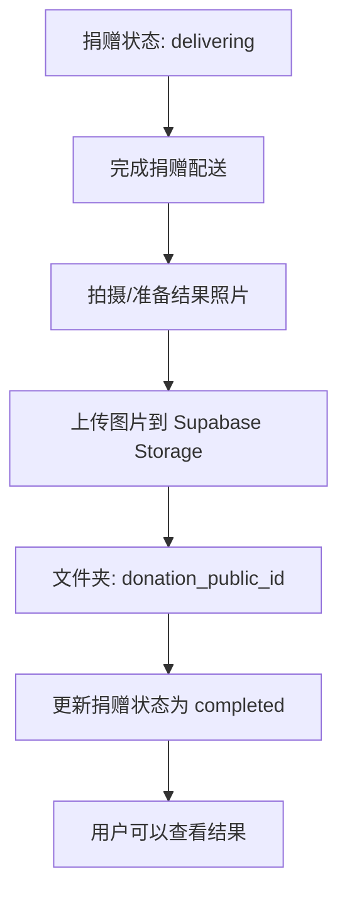

# 捐赠结果查看功能使用指南

## 功能概述

此功能允许用户在捐赠完成后查看捐赠的实际成果（通过图片展示）。只有状态为 `completed` 的捐赠才会显示"查看结果"按钮。

## 工作原理

### 1. 存储结构

使用 Supabase Storage 存储结果图片，存储桶名称：`donation-results`

**文件夹结构：**
```
donation-results/
├── 1-A1B2C3/
│   └── result.jpg
├── 1-X2Y3Z4/
│   └── result.png
├── 23-B4C5D6/
│   └── photo.jpg
└── ...
```

**命名规则：**
- 文件夹名称：捐赠公开ID（例如：`1-A1B2C3`）
- 图片文件名：任意（建议使用 `result.jpg` 或 `result.png`）
- 支持的格式：JPG, PNG, JPEG, WebP
- 文件大小限制：5MB

### 2. 数据库迁移

运行以下迁移来创建存储桶和权限策略：

```bash
# 应用新的迁移
supabase db push

# 或者手动运行
psql -h <your-host> -U postgres -d postgres -f supabase/migrations/004_init_storage.sql
```

**迁移内容：**
- 创建 `donation-results` 存储桶（公开访问）
- 设置 RLS 策略：
  - ✅ 所有人可以查看图片
  - 🔒 只有管理员可以上传/更新/删除图片

### 3. 上传结果图片

#### 方法 A：通过 Supabase Dashboard（推荐）

1. 登录 [Supabase Dashboard](https://app.supabase.com)
2. 选择你的项目
3. 进入 **Storage** → **donation-results**
4. 创建新文件夹，文件夹名称为捐赠ID（例如：`1-A1B2C3`）
5. 进入该文件夹，上传结果图片
6. 图片会自动获得公开访问URL

#### 方法 B：通过 API（适合批量上传）

```typescript
import { createClient } from '@supabase/supabase-js'

const supabase = createClient(
  process.env.NEXT_PUBLIC_SUPABASE_URL!,
  process.env.SUPABASE_SERVICE_ROLE_KEY! // 需要管理员权限
)

async function uploadDonationResult(
  donationPublicId: string,
  imageFile: File
) {
  const filePath = `${donationPublicId}/${imageFile.name}`

  const { data, error } = await supabase.storage
    .from('donation-results')
    .upload(filePath, imageFile, {
      cacheControl: '3600',
      upsert: false
    })

  if (error) {
    console.error('Upload failed:', error)
    return null
  }

  return data
}

// 使用示例
const file = new File([blob], 'result.jpg', { type: 'image/jpeg' })
await uploadDonationResult('1-A1B2C3', file)
```

#### 方法 C：使用 Supabase CLI

```bash
# 上传单个文件
supabase storage cp ./result.jpg donation-results/1-A1B2C3/result.jpg

# 批量上传
for dir in results/*/; do
  donation_id=$(basename "$dir")
  supabase storage cp "$dir/result.jpg" "donation-results/$donation_id/result.jpg"
done
```

### 4. 用户查看流程

用户可以在两个地方查看结果：

#### A. 追踪捐赠页面（`/[locale]/track-donation`）

1. 用户输入邮箱和捐赠ID
2. 系统显示捐赠列表
3. 对于 `completed` 状态的捐赠，显示"查看结果"按钮
4. 点击按钮，打开结果图片模态框

#### B. 项目详情页面（`/[locale]/projects/[projectId]`）

1. 页面底部显示该项目的所有捐赠记录
2. 对于 `completed` 状态的捐赠，显示"查看结果"链接
3. 点击链接，打开结果图片模态框

### 5. 结果查看器功能

**组件位置：** `components/donation/DonationResultViewer.tsx`

**功能特性：**
- ✅ 自动加载图片
- ✅ 全屏模态框展示
- ✅ 下载图片功能
- ✅ 多语言支持（英文/中文/乌克兰语）
- ✅ 加载状态提示
- ✅ 错误处理（无图片、加载失败等）

**错误状态：**
- `invalidDonationId` - 无效的捐赠ID
- `donationNotFound` - 捐赠不存在
- `notCompleted` - 捐赠尚未完成
- `noImage` - 未找到结果图片
- `storageFailed` - 存储访问失败
- `urlFailed` - URL生成失败
- `loadFailed` - 图片加载失败
- `serverError` - 服务器错误

## 工作流程

### 管理员视角



### 用户视角

```mermaid
graph TD
    A[访问追踪捐赠页面] --> B[输入邮箱和捐赠ID]
    B --> C[查看捐赠列表]
    C --> D{捐赠状态是 completed?}
    D -->|是| E[显示"查看结果"按钮]
    D -->|否| F[不显示按钮]
    E --> G[点击按钮]
    G --> H[打开结果图片模态框]
    H --> I[查看/下载图片]
```

## 权限说明

### RLS 策略

**查看权限（公开）：**
```sql
-- 所有人都可以查看结果图片
CREATE POLICY "Public Access - View result images"
ON storage.objects FOR SELECT
USING (bucket_id = 'donation-results');
```

**上传权限（仅管理员）：**
```sql
-- 只有管理员可以上传图片
CREATE POLICY "Admin Only - Upload result images"
ON storage.objects FOR INSERT
WITH CHECK (
  bucket_id = 'donation-results'
  AND auth.uid() IN (
    SELECT id FROM auth.users
    WHERE raw_user_meta_data->>'role' = 'admin'
  )
);
```

### 如何设置管理员

在 Supabase Dashboard 中：

1. 进入 **Authentication** → **Users**
2. 选择要设置为管理员的用户
3. 编辑 **User Metadata**
4. 添加：
   ```json
   {
     "role": "admin"
   }
   ```

## 文件清单

### 新增文件

1. **`supabase/migrations/004_init_storage.sql`**
   - 创建存储桶和权限策略

2. **`components/donation/DonationResultViewer.tsx`**
   - 结果图片查看器组件

3. **`app/actions/donation-result.ts`**
   - 获取结果图片URL的 Server Action

4. **`docs/DONATION_RESULTS_GUIDE.md`**
   - 本使用指南

### 修改文件

1. **`app/[locale]/track-donation/track-donation-form.tsx`**
   - 添加"查看结果"按钮
   - 集成结果查看器模态框

2. **`components/donation/ProjectDonationList.tsx`**
   - 添加"查看结果"链接
   - 集成结果查看器模态框

3. **`messages/en.json`**
   - 添加英文翻译

4. **`messages/zh.json`**
   - 添加中文翻译

5. **`messages/ua.json`**
   - 添加乌克兰语翻译

## 测试清单

### 功能测试

- [ ] 创建存储桶成功
- [ ] 上传图片到正确的文件夹
- [ ] 图片可以公开访问
- [ ] 非管理员无法上传图片
- [ ] `completed` 状态显示"查看结果"按钮
- [ ] 非 `completed` 状态不显示按钮
- [ ] 点击按钮打开模态框
- [ ] 图片正确加载和显示
- [ ] 下载功能正常工作
- [ ] 关闭模态框功能正常
- [ ] 错误状态正确显示（无图片、加载失败等）

### 多语言测试

- [ ] 英文界面显示正确
- [ ] 中文界面显示正确
- [ ] 乌克兰语界面显示正确
- [ ] 错误消息本地化正确

### 权限测试

- [ ] 匿名用户可以查看图片
- [ ] 匿名用户无法上传图片
- [ ] 管理员可以上传图片
- [ ] 管理员可以更新/删除图片

## 常见问题

### Q: 图片上传后用户看不到？

**A:** 检查以下几点：
1. 文件夹名称是否与捐赠ID完全一致
2. 捐赠状态是否为 `completed`
3. 存储桶权限策略是否正确应用
4. 浏览器控制台是否有错误信息

### Q: 如何批量上传多个捐赠的结果图片？

**A:** 使用以下脚本：

```bash
#!/bin/bash
# upload-results.sh

RESULTS_DIR="./donation-results"

for dir in "$RESULTS_DIR"/*/; do
    donation_id=$(basename "$dir")

    # 查找第一个图片文件
    image=$(find "$dir" -type f \( -name "*.jpg" -o -name "*.png" -o -name "*.jpeg" \) | head -n 1)

    if [ -n "$image" ]; then
        echo "Uploading result for $donation_id..."
        supabase storage cp "$image" "donation-results/$donation_id/$(basename "$image")"
    fi
done
```

### Q: 如何限制每个捐赠只能有一张图片？

**A:** 在上传前检查文件夹是否已有文件：

```typescript
const { data: existingFiles } = await supabase.storage
  .from('donation-results')
  .list(donationPublicId)

if (existingFiles && existingFiles.length > 0) {
  // 删除旧文件或提示用户
  console.log('Result already exists')
}
```

### Q: 如何更换已上传的结果图片？

**A:**
1. 在 Supabase Dashboard 中删除旧图片
2. 上传新图片（使用相同或不同的文件名）
3. 或使用 `upsert: true` 选项覆盖

## 安全建议

1. **永远不要**将 Service Role Key 暴露给客户端
2. 定期审查存储桶的访问日志
3. 设置图片大小限制（当前为5MB）
4. 考虑添加图片格式验证
5. 对敏感图片添加水印

## 下一步增强

可能的功能增强：

- [ ] 支持多张图片展示（图片轮播）
- [ ] 添加视频支持
- [ ] 图片压缩和优化
- [ ] 自动生成缩略图
- [ ] 管理员上传界面
- [ ] 批量上传工具
- [ ] 图片审核流程
- [ ] 添加图片描述/标题
- [ ] 导出捐赠报告（包含结果图片）

## 联系支持

如有问题，请联系技术团队或查看项目文档：
- 主文档：`CLAUDE.md`
- Supabase CLI 指南：`docs/SUPABASE_CLI_GUIDE.md`
- 故障排查：`docs/TROUBLESHOOTING.md`

---

**最后更新**: 2025-12-19
**版本**: 1.0.0
